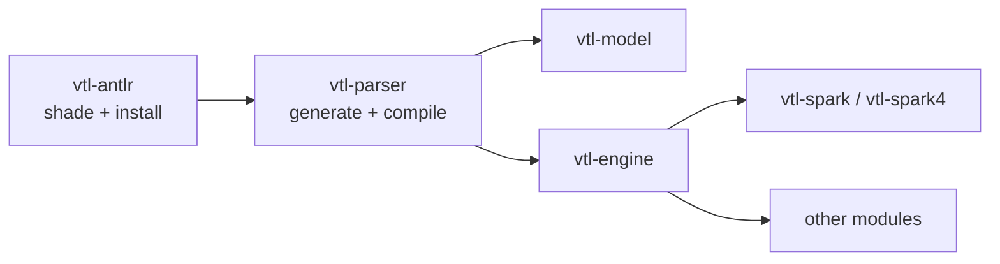

Trevas parses VTL with [ANTLR 4](https://www.antlr.org/). Apache Spark also ships its own copy of the ANTLR runtime on the classpath. Loading two different `org.antlr.v4` runtimes in the same JVM leads to subtle failures (lexer/parser mismatches, `NoClassDefFoundError`, wrong token types).

To avoid that collision, Trevas splits parser construction into two Maven modules that must be built **in order**:

1. **`vtl-antlr`** — shades and relocates the ANTLR 4 runtime into Trevas-owned packages.
2. **`vtl-parser`** — generates the VTL grammar classes and rewrites their imports to use the shaded runtime.
3. **All other modules** (`vtl-model`, `vtl-engine`, Spark integrations, …) — depend on `vtl-parser` (and therefore on `vtl-antlr` transitively) and can be built once the parser stack is installed.

## Why shade the ANTLR runtime?

Spark embeds ANTLR (not necessarily the same minor version Trevas targets). Trevas pins ANTLR **4.9.3** to stay aligned with the runtime Spark carries.

The `vtl-antlr` module uses the Maven Shade Plugin to:

- Copy `org.antlr:antlr4-runtime` into the `vtl-antlr` JAR.
- **Relocate** packages from `org.antlr.v4` to `fr.insee.vtl.antlr`.
- Publish a JPMS module named `fr.insee.vtl.antlr` (via Moditect), exporting the relocated packages.

Downstream code never references `org.antlr.v4` at runtime on the Trevas side; it uses `fr.insee.vtl.antlr` instead. Spark keeps its own ANTLR copy; the two no longer compete for the same class names.

## Module `vtl-antlr`

| Item | Value |
|------|--------|
| Artifact | `fr.insee.trevas:vtl-antlr` |
| Role | Shaded, relocated ANTLR 4 runtime |
| JPMS module | `fr.insee.vtl.antlr` |

Shading runs at the **`process-classes`** phase so the final JAR is available **before** `vtl-parser` compiles. The plain `org.antlr` dependency is marked `optional` so it is not leaked transitively to consumers.

## Module `vtl-parser`

| Item | Value |
|------|--------|
| Artifact | `fr.insee.trevas:vtl-parser` |
| Role | ANTLR-generated lexer/parser/visitor from the [VTL 2.1 grammar](https://github.com/InseeFr/Trevas/tree/master/vtl-parser/src/main/antlr4/fr/insee/vtl/parser) |
| Depends on | `vtl-antlr` |
| JPMS module | `fr.insee.vtl.parser` (`requires transitive fr.insee.vtl.antlr`) |

Build steps inside `vtl-parser`:

1. **ANTLR code generation** (`antlr4-maven-plugin`) from the `.g4` grammar files.
2. **Import rewrite** (`maven-antrun-plugin`, `process-sources`): every `org.antlr.v4` reference in generated sources is replaced with `fr.insee.vtl.antlr`, so compiled classes already point at the shaded runtime.
3. **Compile** and package the parser module.

`vtl-engine` and other modules only need a normal dependency on `vtl-parser`; they do not run the shade step themselves.

## Build choreography

Maven reactor order in the parent POM is intentional:

```text
vtl-antlr  →  vtl-parser  →  vtl-model, vtl-engine, vtl-spark, …
```



### Full reactor (typical local build)

From the repository root:

```bash
mvn clean install
```

Maven builds `vtl-antlr` first, installs it to the local repository, then builds `vtl-parser`, then the rest of the tree.

### Building only the parser stack

When you need to refresh parser artifacts before working on downstream modules:

```bash
mvn install -pl vtl-antlr,vtl-parser -am -DskipTests
```

Always include **`-am`** (*also make*) or list **`vtl-antlr` explicitly**. Building with `-pl vtl-parser` alone does **not** compile the sibling `vtl-antlr` module; Maven will look for `fr.insee.trevas:vtl-antlr` in `~/.m2` or remote repositories. That works on a developer machine after a full install, but fails on a clean CI runner.

### Continuous integration

GitHub Actions jobs that pre-install the parser stack use the same pattern, for example:

```bash
mvn install -pl vtl-antlr,vtl-parser -am -DskipTests
```

TCK and coverage builds use `-pl coverage -am`, which pulls the full upstream chain including `vtl-antlr` and `vtl-parser`.

### IntelliJ / IDE

Import the Trevas parent project as a Maven multi-module project. IntelliJ resolves `vtl-antlr` from the reactor like any other module. If the IDE reports missing `vtl-antlr`, run **`mvn install -pl vtl-antlr,vtl-parser -am`** once, then re-import Maven projects.

## Related documentation

- [VTL ANTLR](/modules/antlr) — module overview.
- [VTL Parser](/modules/parser) — generated grammar API consumed by the engine.
- [VTL Engine](/modules/engine) — executes VTL using the parser and model.
