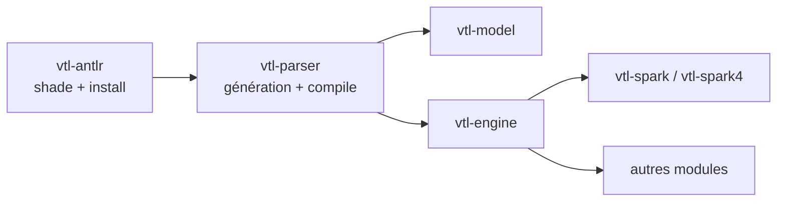

Trevas analyse le VTL avec [ANTLR 4](https://www.antlr.org/). Apache Spark embarque également sa propre copie du runtime ANTLR sur le classpath. Charger deux runtimes `org.antlr.v4` différents dans la même JVM provoque des défaillances difficiles à diagnostiquer (incohérences lexer/parser, `NoClassDefFoundError`, types de jetons incorrects).

Pour éviter cette collision, Trevas scinde la construction du parseur en deux modules Maven à compiler **dans l’ordre** :

1. **`vtl-antlr`** — shade et relocalise le runtime ANTLR 4 dans des paquets Trevas.
2. **`vtl-parser`** — génère les classes de grammaire VTL et réécrit leurs imports pour utiliser le runtime empaqueté.
3. **Tous les autres modules** (`vtl-model`, `vtl-engine`, intégrations Spark, …) — dépendent de `vtl-parser` (et donc de `vtl-antlr` de façon transitive) et peuvent être construits une fois la pile parseur installée.

## Pourquoi empaqueter le runtime ANTLR ?

Spark embarque ANTLR (pas forcément la même version mineure que celle visée par Trevas). Trevas fige ANTLR en **4.9.3** pour rester aligné avec le runtime porté par Spark.

Le module `vtl-antlr` utilise le plugin Maven Shade pour :

- Copier `org.antlr:antlr4-runtime` dans le JAR `vtl-antlr`.
- **Relocaliser** les paquets de `org.antlr.v4` vers `fr.insee.vtl.antlr`.
- Publier un module JPMS nommé `fr.insee.vtl.antlr` (via Moditect), exportant les paquets relocalisés.

Le code aval ne référence jamais `org.antlr.v4` au runtime côté Trevas ; il utilise `fr.insee.vtl.antlr`. Spark conserve sa propre copie d’ANTLR ; les deux ne se disputent plus les mêmes noms de classes.

## Module `vtl-antlr`

| Élément | Valeur |
|--------|--------|
| Artefact | `fr.insee.trevas:vtl-antlr` |
| Rôle | Runtime ANTLR 4 empaqueté et relocalisé |
| Module JPMS | `fr.insee.vtl.antlr` |

Le shading s’exécute en phase **`process-classes`** afin que le JAR final soit disponible **avant** la compilation de `vtl-parser`. La dépendance `org.antlr` est marquée `optional` pour ne pas fuir transitivement vers les consommateurs.

## Module `vtl-parser`

| Élément | Valeur |
|--------|--------|
| Artefact | `fr.insee.trevas:vtl-parser` |
| Rôle | Lexer/parser/visitor générés par ANTLR à partir de la [grammaire VTL 2.1](https://github.com/InseeFr/Trevas/tree/master/vtl-parser/src/main/antlr4/fr/insee/vtl/parser) |
| Dépend de | `vtl-antlr` |
| Module JPMS | `fr.insee.vtl.parser` (`requires transitive fr.insee.vtl.antlr`) |

Étapes de build dans `vtl-parser` :

1. **Génération ANTLR** (`antlr4-maven-plugin`) à partir des fichiers `.g4`.
2. **Réécriture des imports** (`maven-antrun-plugin`, `process-sources`) : chaque référence `org.antlr.v4` dans les sources générées est remplacée par `fr.insee.vtl.antlr`.
3. **Compilation** et packaging du module parseur.

`vtl-engine` et les autres modules n’ont besoin que d’une dépendance normale sur `vtl-parser` ; ils n’exécutent pas eux-mêmes le shade.

## Enchaînement de compilation

L’ordre du réacteur Maven dans le POM parent est volontaire :

```text
vtl-antlr  →  vtl-parser  →  vtl-model, vtl-engine, vtl-spark, …
```



### Réacteur complet (build local typique)

À la racine du dépôt :

```bash
mvn clean install
```

Maven construit d’abord `vtl-antlr`, l’installe dans le dépôt local, puis `vtl-parser`, puis le reste de l’arbre.

### Compiler uniquement la pile parseur

Pour régénérer les artefacts parseur avant de travailler sur les modules aval :

```bash
mvn install -pl vtl-antlr,vtl-parser -am -DskipTests
```

Toujours inclure **`-am`** (*also make*) ou lister **`vtl-antlr` explicitement**. Avec `-pl vtl-parser` seul, Maven **ne compile pas** le module frère `vtl-antlr` ; il cherche `fr.insee.trevas:vtl-antlr` dans `~/.m2` ou les dépôts distants. Cela fonctionne en local après un install complet, mais échoue sur un runner CI vierge.

### Intégration continue

Les jobs GitHub Actions qui pré-installent la pile parseur utilisent le même schéma, par exemple :

```bash
mvn install -pl vtl-antlr,vtl-parser -am -DskipTests
```

Les builds TCK et coverage utilisent `-pl coverage -am`, ce qui tire toute la chaîne amont, y compris `vtl-antlr` et `vtl-parser`.

### IntelliJ / IDE

Importer le projet parent Trevas comme projet Maven multi-modules. IntelliJ résout `vtl-antlr` depuis le réacteur. Si l’IDE signale `vtl-antlr` manquant, exécuter une fois **`mvn install -pl vtl-antlr,vtl-parser -am`**, puis réimporter les projets Maven.

## Documentation associée

- [VTL ANTLR](/modules/antlr) — vue d’ensemble du module.
- [VTL Parser](/modules/parser) — API de grammaire générée consommée par le moteur.
- [VTL Engine](/modules/engine) — exécution VTL à partir du parseur et du modèle.
