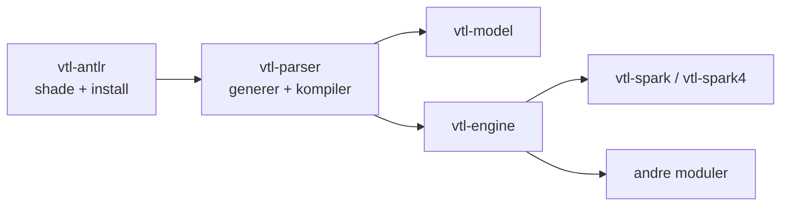

Trevas parser VTL med [ANTLR 4](https://www.antlr.org/). Apache Spark leverer også sin egen kopi av ANTLR-runtime på classpath. Å laste to ulike `org.antlr.v4`-runtimes i samme JVM gir subtile feil (lexer/parser-avvik, `NoClassDefFoundError`, feil tokentyper).

For å unngå kollisjonen deler Trevas parserbyggingen i to Maven-moduler som må bygges **i rekkefølge**:

1. **`vtl-antlr`** — shadet og flytter ANTLR 4-runtime til Trevas-eide pakker.
2. **`vtl-parser`** — genererer VTL-grammatikklasser og omskriver importene til den shadete runtime.
3. **Alle andre moduler** (`vtl-model`, `vtl-engine`, Spark-integrasjoner, …) — avhenger av `vtl-parser` (og dermed transitivt av `vtl-antlr`) og kan bygges når parserstakken er installert.

## Hvorfor shade ANTLR-runtime?

Spark inneholder ANTLR (ikke nødvendigvis samme minor-versjon som Trevas sikter mot). Trevas låser ANTLR til **4.9.3** for å holde seg på linje med runtime Spark bærer.

Modulen `vtl-antlr` bruker Maven Shade Plugin til å:

- Kopiere `org.antlr:antlr4-runtime` inn i `vtl-antlr`-JAR-en.
- **Flytte** pakker fra `org.antlr.v4` til `fr.insee.vtl.antlr`.
- Publisere en JPMS-modul `fr.insee.vtl.antlr` (via Moditect) som eksporterer de flyttede pakkene.

Nedstrømskode refererer aldri til `org.antlr.v4` ved runtime på Trevas-siden; den bruker `fr.insee.vtl.antlr`. Spark beholder sin egen ANTLR-kopi; de to konkurrerer ikke lenger om samme klassenavn.

## Modul `vtl-antlr`

| Felt | Verdi |
|------|--------|
| Artefakt | `fr.insee.trevas:vtl-antlr` |
| Rolle | Shadet, flyttet ANTLR 4-runtime |
| JPMS-modul | `fr.insee.vtl.antlr` |

Shading kjører i **`process-classes`**-fasen slik at den endelige JAR-en er tilgjengelig **før** `vtl-parser` kompileres. Den vanlige `org.antlr`-avhengigheten er merket `optional` for ikke å lekke transitivt til konsumenter.

## Modul `vtl-parser`

| Felt | Verdi |
|------|--------|
| Artefakt | `fr.insee.trevas:vtl-parser` |
| Rolle | ANTLR-generert lexer/parser/visitor fra [VTL 2.1-grammatikken](https://github.com/InseeFr/Trevas/tree/master/vtl-parser/src/main/antlr4/fr/insee/vtl/parser) |
| Avhenger av | `vtl-antlr` |
| JPMS-modul | `fr.insee.vtl.parser` (`requires transitive fr.insee.vtl.antlr`) |

Byggtrinn i `vtl-parser`:

1. **ANTLR-kodegenerering** (`antlr4-maven-plugin`) fra `.g4`-filene.
2. **Import-omskriving** (`maven-antrun-plugin`, `process-sources`): hver `org.antlr.v4`-referanse i generert kilde erstattes med `fr.insee.vtl.antlr`.
3. **Kompiler** og pakk parsermodulen.

`vtl-engine` og andre moduler trenger bare en vanlig avhengighet til `vtl-parser`; de kjører ikke shade selv.

## Byggrekkefølge

Maven-reaktorrekkefølgen i foreldre-POM er bevisst:

```text
vtl-antlr  →  vtl-parser  →  vtl-model, vtl-engine, vtl-spark, …
```



### Full reaktor (typisk lokalt bygg)

Fra rot i depotet:

```bash
mvn clean install
```

Maven bygger først `vtl-antlr`, installerer den lokalt, deretter `vtl-parser`, så resten av treet.

### Bygge bare parserstakken

Når du må oppdatere parserartefakter før arbeid på nedstrømsmoduler:

```bash
mvn install -pl vtl-antlr,vtl-parser -am -DskipTests
```

Inkluder alltid **`-am`** (*also make*) eller list **`vtl-antlr` eksplisitt**. Med bare `-pl vtl-parser` kompilerer Maven **ikke** søstermodulen `vtl-antlr`; den leter etter `fr.insee.trevas:vtl-antlr` i `~/.m2` eller eksterne repo. Det fungerer lokalt etter full install, men feiler på en ren CI-runner.

### Kontinuerlig integrasjon

GitHub Actions-jobber som forhåndsinstallerer parserstakken bruker samme mønster, for eksempel:

```bash
mvn install -pl vtl-antlr,vtl-parser -am -DskipTests
```

TCK- og coverage-bygg bruker `-pl coverage -am`, som trekker hele oppstrømskjeden inkludert `vtl-antlr` og `vtl-parser`.

### IntelliJ / IDE

Importer Trevas-foreldreprosjektet som et Maven flermodulsprosjekt. IntelliJ løser `vtl-antlr` fra reaktoren. Hvis IDE melder manglende `vtl-antlr`, kjør **`mvn install -pl vtl-antlr,vtl-parser -am`** én gang, og importer Maven-prosjektene på nytt.

## Relatert dokumentasjon

- [VTL ANTLR](/modules/antlr) — moduloversikt.
- [VTL Parser](/modules/parser) — generert grammatikk-API brukt av motoren.
- [VTL Engine](/modules/engine) — kjører VTL med parser og modell.
