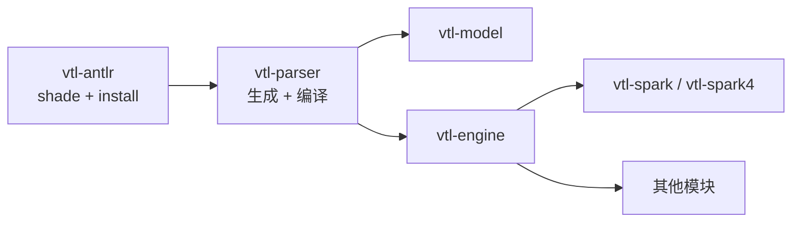

Trevas 使用 [ANTLR 4](https://www.antlr.org/) 解析 VTL。Apache Spark 也会在 classpath 上自带一份 ANTLR 运行时。在同一个 JVM 里加载两个不同的 `org.antlr.v4` 运行时，容易出现难查的问题（词法/语法分析器不一致、`NoClassDefFoundError`、token 类型错误等）。

为避免冲突，Trevas 把解析器构建拆成两个 Maven 模块，必须**按顺序**编译：

1. **`vtl-antlr`** — 对 ANTLR 4 运行时做 shade，并把包重定位到 Trevas 自己的命名空间。
2. **`vtl-parser`** — 根据 VTL 语法生成类，并把 import 改成使用 shade 后的运行时。
3. **其余模块**（`vtl-model`、`vtl-engine`、Spark 集成等）— 依赖 `vtl-parser`（从而间接依赖 `vtl-antlr`），在解析器栈安装完成后即可构建。

## 为什么要 shade ANTLR 运行时？

Spark 内置了 ANTLR（版本不一定与 Trevas 目标版本一致）。Trevas 固定使用 ANTLR **4.9.3**，与 Spark 所带的运行时保持一致。

`vtl-antlr` 模块通过 Maven Shade 插件：

- 将 `org.antlr:antlr4-runtime` 打进 `vtl-antlr` 的 JAR；
- 把 `org.antlr.v4` **重定位**为 `fr.insee.vtl.antlr`；
- 通过 Moditect 发布 JPMS 模块 `fr.insee.vtl.antlr`，并导出重定位后的包。

Trevas 侧运行时代码不再使用 `org.antlr.v4`，而是使用 `fr.insee.vtl.antlr`。Spark 仍使用自己的 ANTLR 副本，两者不再争抢同一套类名。

## 模块 `vtl-antlr`

| 项 | 值 |
|----|-----|
| 构件 | `fr.insee.trevas:vtl-antlr` |
| 作用 | 已 shade、已重定位的 ANTLR 4 运行时 |
| JPMS 模块 | `fr.insee.vtl.antlr` |

Shade 在 **`process-classes`** 阶段执行，以便在编译 `vtl-parser` **之前**就生成最终 JAR。`org.antlr` 依赖标记为 `optional`，避免向下游传递泄漏。

## 模块 `vtl-parser`

| 项 | 值 |
|----|-----|
| 构件 | `fr.insee.trevas:vtl-parser` |
| 作用 | 由 [VTL 2.1 语法](https://github.com/InseeFr/Trevas/tree/master/vtl-parser/src/main/antlr4/fr/insee/vtl/parser) 生成的 lexer/parser/visitor |
| 依赖 | `vtl-antlr` |
| JPMS 模块 | `fr.insee.vtl.parser`（`requires transitive fr.insee.vtl.antlr`） |

`vtl-parser` 内部构建步骤：

1. **ANTLR 代码生成**（`antlr4-maven-plugin`）处理 `.g4` 文件；
2. **改写 import**（`maven-antrun-plugin`，`process-sources`）：生成源码中的 `org.antlr.v4` 全部替换为 `fr.insee.vtl.antlr`；
3. **编译**并打包解析器模块。

`vtl-engine` 等模块只需正常依赖 `vtl-parser`，无需自行执行 shade。

## 构建顺序

父 POM 中的 Maven 反应堆顺序是刻意设计的：

```text
vtl-antlr  →  vtl-parser  →  vtl-model, vtl-engine, vtl-spark, …
```



### 完整反应堆（本地常见做法）

在仓库根目录执行：

```bash
mvn clean install
```

Maven 先构建 `vtl-antlr` 并安装到本地仓库，再构建 `vtl-parser`，然后构建其余模块。

### 只构建解析器栈

在开发下游模块前需要刷新解析器产物时：

```bash
mvn install -pl vtl-antlr,vtl-parser -am -DskipTests
```

务必加上 **`-am`**（*also make*），或**显式列出 `vtl-antlr`**。若只用 `-pl vtl-parser`，Maven **不会**编译同级的 `vtl-antlr` 模块，而是到 `~/.m2` 或远程仓库查找。本地在完整 install 之后通常没问题，但在干净的 CI 环境会失败。

### 持续集成

GitHub Actions 中预装解析器栈的作业使用相同方式，例如：

```bash
mvn install -pl vtl-antlr,vtl-parser -am -DskipTests
```

TCK 与 coverage 构建使用 `-pl coverage -am`，会拉取包含 `vtl-antlr` 和 `vtl-parser` 的完整上游链。

### IntelliJ / IDE

将 Trevas 父工程作为 Maven 多模块项目导入。IntelliJ 会像其他模块一样从反应堆解析 `vtl-antlr`。若 IDE 提示缺少 `vtl-antlr`，先执行一次 **`mvn install -pl vtl-antlr,vtl-parser -am`**，再重新导入 Maven 项目。

## 相关文档

- [VTL ANTLR 模块](/modules/antlr) — 模块概览。
- [VTL 语言解析模块](/modules/parser) — 引擎使用的语法 API。
- [VTL Engine](/modules/engine) — 基于解析器与模型执行 VTL。
