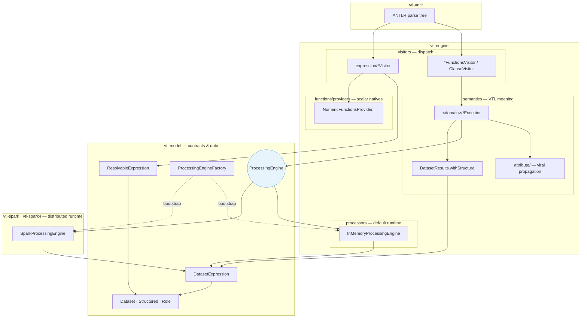

# VTL Engine

## Architecture Pattern

The engine follows a clear 4-step flow for dataset operators:

1. `visitors/*FunctionsVisitor` (and `ClauseVisitor`) only dispatch parse-tree nodes.
2. `semantics/<domain>/*Executor` applies VTL semantics (roles, structure, validation, planning).
3. `ProcessingEngine` executes mechanical operations (join, filter, aggregate, etc.).
4. `semantics.DatasetResults.withStructure(...)` re-attaches VTL structural metadata to mechanical results.

This keeps concerns separated: visitors route, semantics decide, processors execute.

The engine never depends on a concrete runtime: semantics call the `ProcessingEngine` interface from **vtl-model**. Implementations are plugged in at bootstrap via `ProcessingEngineFactory`.

### Diagram

**Dataset path** (operators): visitor → executor → `ProcessingEngine` → `DatasetResults.withStructure` → `DatasetExpression`.

**Scalar path** (row expressions): `expression/*Visitor` builds `ResolvableExpression` directly — no `ProcessingEngine`.

### Package Roles

| Module | Package / class | Role |
|--------|-----------------|------|
| **vtl-antlr** | generated visitors | VTL grammar, parse tree |
| **vtl-model** | `ProcessingEngine`, `DatasetExpression`, `ResolvableExpression`, `Dataset` | Runtime-agnostic contracts and data bindings |
| **vtl-engine** | `visitors` | Parse-tree dispatch only |
| **vtl-engine** | `semantics.<domain>` | VTL operator logic (`join`, `aggregation`, `validation`, `time`, …) |
| **vtl-engine** | `semantics.attribute` | Cross-cutting viral attribute propagation |
| **vtl-engine** | `processors.InMemoryProcessingEngine` | Default in-memory `ProcessingEngine` |
| **vtl-engine** | `functions.providers` | Built-in scalar native functions (`Map<String, List<Method>>`) |
| **vtl-spark** / **vtl-spark4** | `SparkProcessingEngine` | Spark-backed `ProcessingEngine` |
