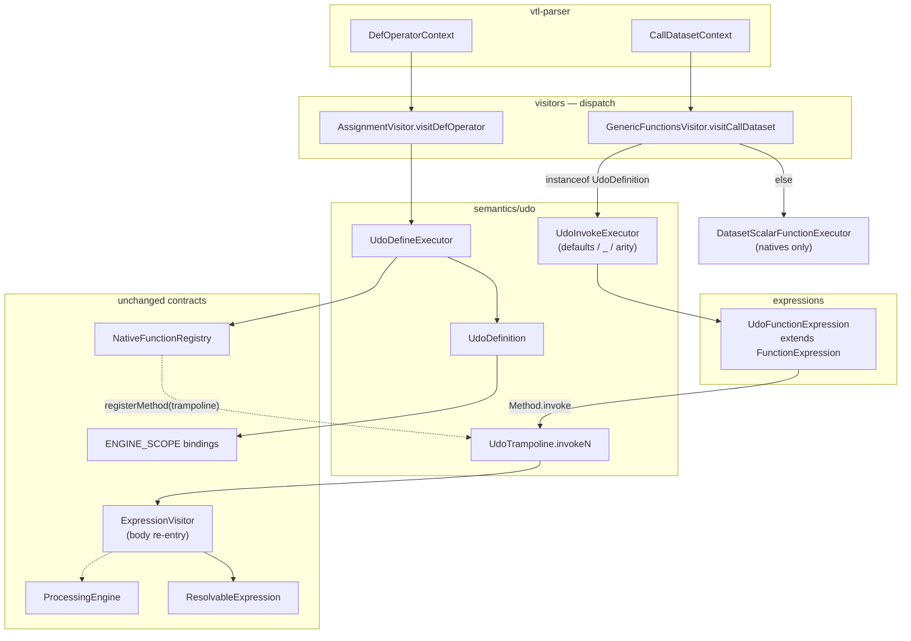

# 01 — Architecture (locked pattern)

UDOs follow `vtl-engine/README.md`: visitors route → semantics decide → processors execute.

**P0 invoke path (validated):** body evaluation goes through `FunctionExpression` → `java.lang.reflect.Method.invoke` (trampoline), not through `DatasetScalarFunctionExecutor`.

## Target flow



## End-to-end steps

### Define

1. `AssignmentVisitor.visitDefOperator`
2. `UdoDefineExecutor.define` → parse signature (P0 subset) + capture `ExprContext` body
3. Reject if `bindings.containsKey(name)` **or** name already in native/global registry (E6 / E8)
4. `bindings.put(name, udo)` — **source of truth**
5. `engine.registerMethod(name, UdoTrampoline.methodForArity(n))` — dispatch hook only

### Invoke

1. `GenericFunctionsVisitor.visitCallDataset` — **must** keep raw `parameter` contexts (for `_`)
2. If `bindings.get(name) instanceof UdoDefinition` → `UdoInvokeExecutor.invoke`
3. Else → existing `invokeFunction` / `DatasetScalarFunctionExecutor` (natives)
4. `UdoInvokeExecutor` builds `List<ResolvableExpression>` (actuals / defaults / `_`)
5. Returns `UdoFunctionExpression` (subclass of `FunctionExpression`)
6. On `resolve`: `UdoTrampoline.enter(udo, outerBindings)` → `Method.invoke` → `dispatch` builds child scope → `ExpressionVisitor.visit(body)` → `exit`

Why not put the UDO check inside `invokeFunction`? That API only sees already-visited expressions — `_` and defaults need the parse tree. Keep the fork in `visitCallDataset`.

## Layer responsibilities

| Layer | Class | Does | Does not |
|-------|-------|------|----------|
| Define visitor | `AssignmentVisitor.visitDefOperator` | Collision checks, put binding, register trampoline | Body eval |
| Define semantics | `UdoDefineExecutor` | Signature parse, defaults type-check | Invoke |
| Invoke visitor | `GenericFunctionsVisitor.visitCallDataset` | UDO vs native fork | Defaulting logic |
| Invoke semantics | `UdoInvokeExecutor` | Arity, `_`, defaults, arg types | `Method.invoke` |
| Expression | `UdoFunctionExpression` | ThreadLocal CallSite + `FunctionExpression.resolve` | Body AST walk |
| Trampoline | `UdoTrampoline` | Child bindings + `ExpressionVisitor` + return check | PE branching |
| Artefact | `UdoDefinition` | Name, params, returns, body, engine ref | Java Method itself |
| Clauses | `ClauseVisitor` | Merge **outer bindings** into component map | — |

## Artefact vs Method

| | Bindings `UdoDefinition` | Registry trampoline `Method` |
|--|--------------------------|------------------------------|
| Role | Source of truth (body, formals) | Lets call sites use `FunctionExpression` |
| Lookup | `instanceof UdoDefinition` first | Registered under same VTL name |
| Body | ANTLR `ExprContext` | Static `invoke0…8(Object…)` → re-enter visitor |

Do **not** treat UDOs as normal `FunctionProvider` natives. The trampoline is an adapter so resolution reuses `FunctionExpression` / `Method.invoke`; semantics stay in `semantics/udo`.

## Scope rules

1. Params shadow outer names inside the body.
2. Free vars: **invoke-time** lookup in outer bindings ([08 §1](./08-open-questions.md)).
3. Child scope discarded after return.
4. Dataset clauses see UDO scalar params via outer-bindings merge in `ClauseVisitor` (needed for `ds[filter long1 > threshold]`).

## DatasetScalarFunctionExecutor

UDOs **must not** go through mono-measure lift in P0. Scalar UDO + dataset actual → type error (P1 may revisit).

## File placement (as implemented)

```
vtl-engine/.../semantics/udo/UdoDefinition.java
vtl-engine/.../semantics/udo/UdoParameter.java
vtl-engine/.../semantics/udo/UdoDefineExecutor.java
vtl-engine/.../semantics/udo/UdoInvokeExecutor.java
vtl-engine/.../semantics/udo/UdoTrampoline.java
vtl-engine/.../expressions/UdoFunctionExpression.java
vtl-engine/.../visitors/AssignmentVisitor.java          // visitDefOperator
vtl-engine/.../visitors/expression/functions/GenericFunctionsVisitor.java
vtl-engine/.../visitors/ClauseVisitor.java              // outer bindings merge
vtl-engine/src/test/.../visitors/UserDefinedOperatorTest.java
vtl-engine/src/test/.../semantics/udo/UdoPatternWalkthroughTest.java
```

## Module note

`Fun.toMethod` (natives) needs:

```java
opens fr.insee.vtl.engine.functions.providers to safety.mirror;
```

(`opens fr.insee.vtl.engine` does not open subpackages.)
