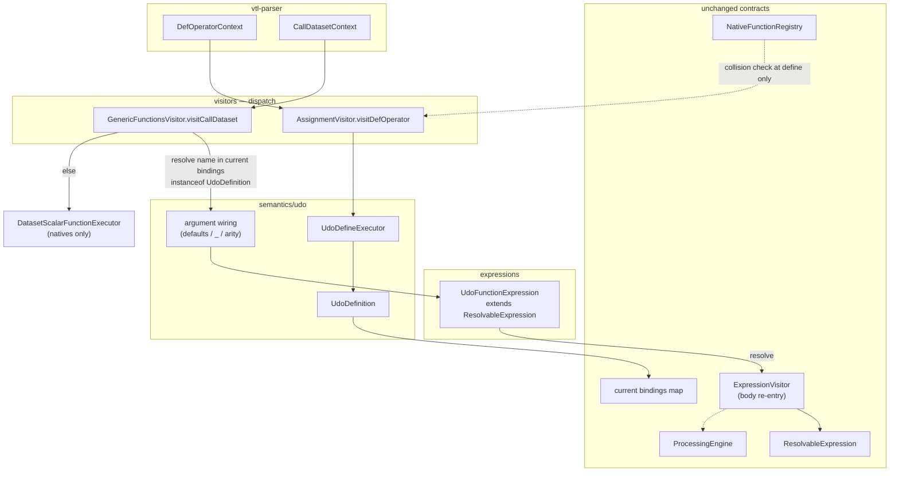

# 01 — Architecture

UDOs follow `vtl-engine/README.md`: visitors route → semantics decide → processors execute.

**Target invoke path (review follow-up):** the operator id is resolved like a variable (`UdoDefinition` in bindings). Evaluation is a `ResolvableExpression` that visits the body. No `registerMethod` / `Method.invoke` trampoline.

The spike in this PR still uses a trampoline `Method` so `FunctionExpression` could call `invoke`. That path is **to be replaced** — it bypasses bindings and makes scoping/closures moot. See [08 §6a](./08-open-questions.md).

## Target flow



## End-to-end steps

### Define

1. `AssignmentVisitor.visitDefOperator`
2. `UdoDefineExecutor.define` → parse signature (P0 subset) + capture `ExprContext` body
3. Reject if `bindings.containsKey(name)` → `AlreadyDefinedException` (E6)
4. Reject if name already in native/global registry (E8) — **do not** register a trampoline
5. `bindings.put(name, udo)` — **only** source of truth

### Invoke

1. `GenericFunctionsVisitor.visitCallDataset` — **must** keep raw `parameter` contexts (for `_`)
2. Resolve `name` in the **current** expression bindings (not always `ENGINE_SCOPE`)
3. If `instanceof UdoDefinition` → wire args (actuals / defaults / `_`) → `UdoFunctionExpression`
4. Else → existing `invokeFunction` / `DatasetScalarFunctionExecutor` (natives)
5. On `resolve`: child map = outer bindings + formals → `ExpressionVisitor.visit(body)` → `body.resolve`

Why not put the UDO check inside `invokeFunction`? That API only sees already-visited expressions — `_` and defaults need the parse tree. Keep the fork in `visitCallDataset`.

## Layer responsibilities

| Layer | Class | Does | Does not |
|-------|-------|------|----------|
| Define visitor | `AssignmentVisitor.visitDefOperator` | Collision checks, put binding | Body eval, `registerMethod` |
| Define semantics | `UdoDefineExecutor` | Signature parse, defaults type-check | Invoke |
| Invoke visitor | `GenericFunctionsVisitor.visitCallDataset` | UDO vs native fork on **current** bindings | Defaulting logic |
| Arg wiring | helper (today `UdoInvokeExecutor`) | Arity, `_`, defaults, arg types | Fake `Method.invoke` |
| Expression | `UdoFunctionExpression` | `ResolvableExpression` contract: type + `resolve` body | Registry / trampoline |
| Artefact | `UdoDefinition` | Name, params, returns, body, engine ref | Java `Method` |
| Clauses | `ClauseVisitor` | Merge **outer bindings** into component map | — |

## Artefact vs natives

| | Bindings `UdoDefinition` | Native registry |
|--|--------------------------|-----------------|
| Role | Source of truth (body, formals) | Built-in Java methods only |
| Lookup | resolve operator id like a variable | `findMethod` if not a UDO |
| Body | ANTLR `ExprContext` | real `Method` |

Do **not** treat UDOs as `FunctionProvider` natives and do **not** put a trampoline `Method` in the registry.

## Scope rules

1. Params shadow outer names inside the body.
2. Free vars: **invoke-time** lookup in the bindings passed to `resolve` ([08 §1](./08-open-questions.md)). Not a lexical closure in P0 (no snapshot at define).
3. Child scope discarded after return.
4. Dataset clauses see UDO scalar params via outer-bindings merge in `ClauseVisitor` (needed for `ds[filter long1 > threshold]`).

## DatasetScalarFunctionExecutor

UDOs **must not** go through mono-measure lift in P0. Scalar UDO + dataset actual → type error (P1 may revisit).

## File placement

```
vtl-engine/.../semantics/udo/UdoDefinition.java
vtl-engine/.../semantics/udo/UdoParameter.java
vtl-engine/.../semantics/udo/UdoDefineExecutor.java
vtl-engine/.../semantics/udo/UdoInvokeExecutor.java   // arg wiring (defaults / _)
vtl-engine/.../expressions/UdoFunctionExpression.java
vtl-engine/.../visitors/AssignmentVisitor.java
vtl-engine/.../visitors/expression/functions/GenericFunctionsVisitor.java
vtl-engine/.../visitors/ClauseVisitor.java
```

`UdoTrampoline` has been removed — evaluation is `UdoFunctionExpression.resolve`.
