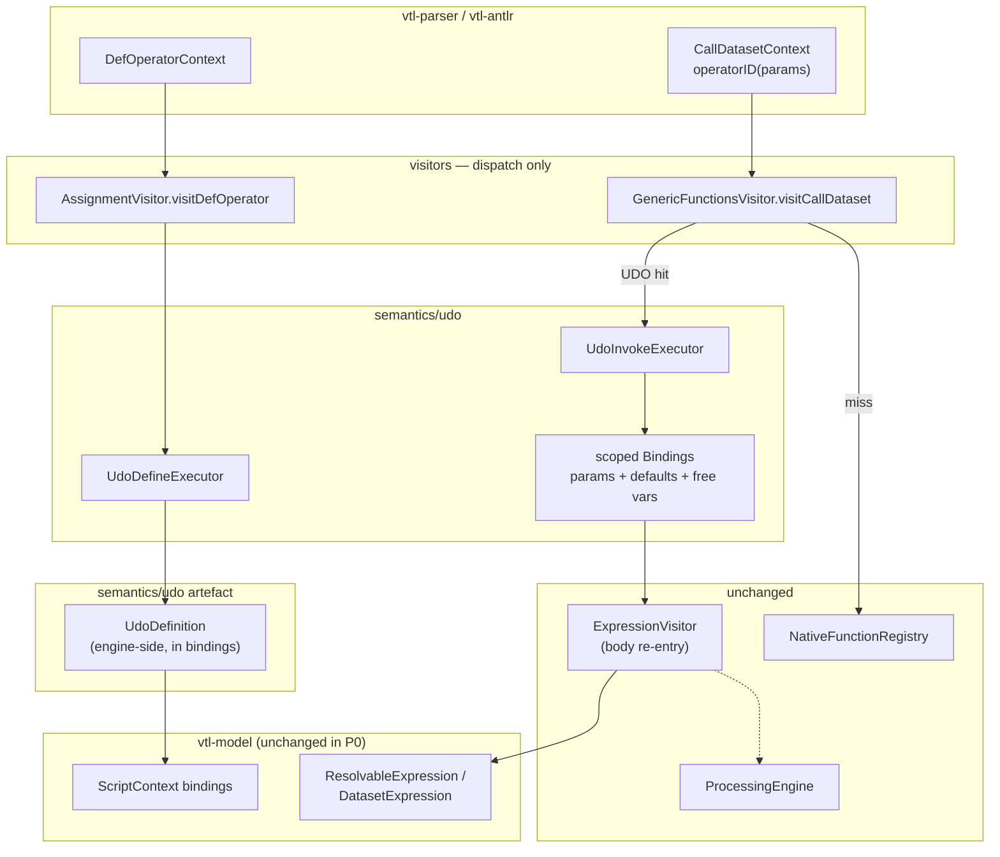

# 01 — Architecture (Trevas layers)

UDOs must follow the engine pattern documented in `vtl-engine/README.md`:

> visitors route → semantics decide → processors execute

## Target flow



## Layer responsibilities

| Layer | Package / class | Does | Does not |
|-------|-----------------|------|----------|
| Grammar | `Vtl.g4` `defOperator`, `genericOperators` | Already parses define + call | No change expected in P0 |
| DAG | `DAGBuildingVisitor.visitDefOperator` | Orders define before use; treats params as inner scope; tracks `OPERATOR` deps | Must stay the source of truth for reordering |
| Define visitor | `AssignmentVisitor.visitDefOperator` | Thin dispatch → `UdoDefineExecutor` | No type logic, no body eval beyond what’s needed to build the artefact |
| Invoke visitor | `GenericFunctionsVisitor.visitCallDataset` | Look up UDO in bindings **before** native method resolve | Must not embed defaulting / type checks |
| Semantics | `semantics/udo/UdoDefineExecutor`, `UdoInvokeExecutor` | Signature parse (subset), validation, defaults, scoped body evaluation, return-type check | No Spark / PE branching |
| Artefact (P0) | `semantics/udo/UdoDefinition` | Immutable runtime entry in bindings (may hold `ExprContext`) | Not a `Method`, not a `FunctionProvider` entry; **no** `vtl-model` DTO in P0 |
| Processors | `InMemoryProcessingEngine` / Spark | Unchanged | No UDO-specific API |

## Why not register UDOs as `FunctionProvider` methods

Natives are Java `Method` reflections with Java parameter classes. A UDO body is a **VTL expression tree** (or a deferred parse subtree) that needs:

- named parameters (not positional Java args only)
- defaults and `OPTIONAL`
- free variable capture from the defining script scope
- VTL structural typing later

Forcing UDOs into `NativeFunctionRegistry` would fight the model. Keep them as **first-class bindings artefacts**, like `DataPointRuleset`.

Optional later optimization: a thin adapter that exposes a UDO to the same invoke path as natives — but the source of truth remains the bindings artefact.

## Re-entrancy into `ExpressionVisitor`

Body evaluation **must** re-enter `ExpressionVisitor` with a child bindings map:

```
parent bindings (ENGINE_SCOPE)
  ⊕ parameter bindings (actuals / defaults)
  ⊕ (optional) frozen free-var snapshot
```

This mirrors how clause/calc contexts introduce component-level scopes, but for UDOs the scope is variable-level.

Critical rules:

1. Parameter names shadow outer variables inside the body.
2. Free variables: **invoke-time lookup** in current bindings after DAG reorder ([08 §1](./08-open-questions.md)). Matches fixture `max_with_y`.
3. The body must not leak parameter bindings into the outer scope after return.

## Interaction with `DatasetScalarFunctionExecutor`

Today `visitCallDataset` always goes to `DatasetScalarFunctionExecutor.invoke`, which looks up a Java method and may lift scalars to mono-measure datasets.

For UDOs:

```
visitCallDataset:
  if bindings.get(name) instanceof UdoDefinition udo:
      return UdoInvokeExecutor.invoke(...)
  else:
      return DatasetScalarFunctionExecutor.invoke(...)  // existing
```

Do **not** try to make a UDO look like a reflective Method so that `DatasetScalarFunctionExecutor` can “just work”. Dataset lifting for UDO scalar bodies can be a **P1** concern if product needs `DS := udo(DS)` style promotion; P0 can require scalar actuals for scalar signatures.

## Provenance / SDMX / Jackson

Out of scope for P0. If `vtl-prov` walks define statements, extend later similarly to rulesets (`AntlrUtils` already touches `defOperators`). Track as follow-up, not a blocker. A `vtl-model` DTO can appear then if serialization needs it.

## File placement proposal (P0)

```
vtl-engine/.../visitors/AssignmentVisitor.java          // +visitDefOperator
vtl-engine/.../visitors/expression/functions/GenericFunctionsVisitor.java  // UDO lookup
vtl-engine/.../semantics/udo/UdoDefinition.java         // artefact + params (engine)
vtl-engine/.../semantics/udo/UdoDefineExecutor.java
vtl-engine/.../semantics/udo/UdoInvokeExecutor.java
vtl-engine/.../semantics/udo/UdoTypeSupport.java        // phased type subset
vtl-engine/.../semantics/udo/package-info.java
vtl-engine/src/test/.../semantics/udo/...               // optional unit tests
vtl-engine/src/test/.../visitors/UserDefinedOperatorTest.java  // acceptance (exists)
```
