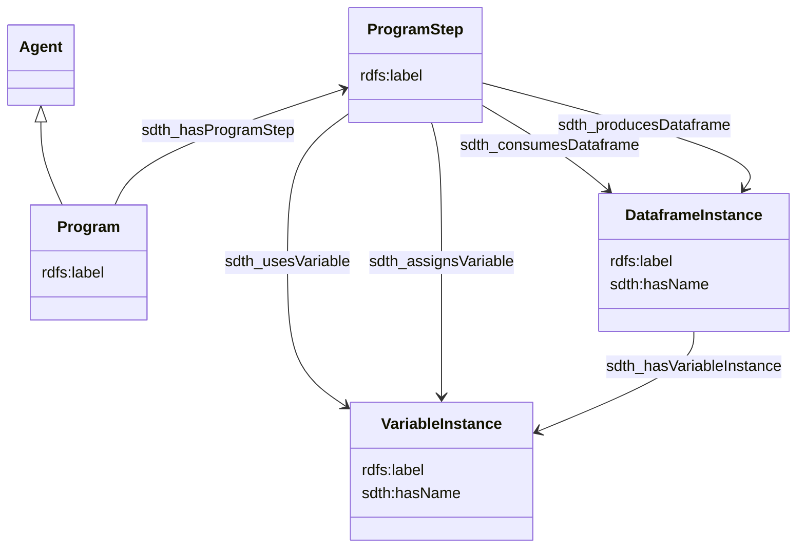
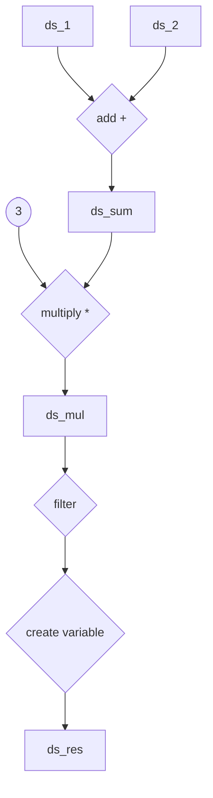

# Provenance

## Description

[Data provenance](https://www.nnlm.gov/guides/data-glossary/data-provenance) is key to a good data management. 

his document present how we could extract some provenance from a VTL program in Trevas, using linked open data standards:

- [PROV](https://www.w3.org/TR/prov-o/)
- SDTH (ref ?)

## Modelisation

Based on `PROV-O` and `SDTH` ontologies.



## Example

### Business use case

Two sources datasets are transformed to produce transient datasets and a final permanent one.



### Inputs

`ds1` & `ds2` metadata

|id|var1|var2|
|:-:|:-:|:-:|
|STRING|INTEGER|NUMBER|
|IDENTIFIER|MEASURE|MEASURE|

### VTL script

```vtl
ds_sum := ds1 + ds2;
ds_mul := ds_sum * 3; 
ds_res <- ds_mul[filter mod(var1, 2) = 0][calc var_sum := var1 + var2];
```

### RDF model target

```ttl
PREFIX rdfs: <http://www.w3.org/2000/01/rdf-schema#>
PREFIX sh: <http://www.w3.org/ns/shacl#>
PREFIX fluxShape: <https://ld.flux.zazuko.com/shapes/metadata/>
PREFIX flux: <https://ld.flux.zazuko.com/>
PREFIX fluxSchema: <https://flux.described.at/>
PREFIX prov:       <http://www.w3.org/ns/prov#>
PREFIX sdth:         <http://rdf-vocabulary.ddialliance.org/sdth#>

flux:ProgramToProgramStep a sh:PropertyShape, fluxSchema:Link ;
   sh:name "has program step" ;
   sh:path sdth:hasProgramStep;
   sh:class  sdth:ProgramStep  ;
   sh:targetClass sdth:Program .

flux:ProgramStepToDataframeInstanceConsumes a sh:PropertyShape, fluxSchema:Link ;
   sh:name "consumes Dataframe" ;
   sh:path sdth:consumesDataframe;
   sh:class  sdth:DataframeInstance  ;
   sh:targetClass sdth:ProgramStep .

flux:ProgramStepToDataframeInstanceProduces a sh:PropertyShape, fluxSchema:Link ;
   sh:name "produces Dataframe" ;
   sh:path sdth:producesDataframe ;
   sh:class sdth:DataframeInstance ;
   sh:targetClass sdth:ProgramStep .

flux:ProgramStepToVariableInstanceUses a sh:PropertyShape, fluxSchema:Link ;
   sh:name "uses variable" ;
   sh:path sdth:usesVariable ;
   sh:class sdth:VariableInstance ;
   sh:targetClass sdth:ProgramStep .

flux:ProgramStepToVariableInstanceAssigns a sh:PropertyShape, fluxSchema:Link ;
   sh:name "assigns variable" ;
   sh:path sdth:assignsVariable ;
   sh:class sdth:VariableInstance ;
   sh:targetClass sdth:ProgramStep .

flux:DataframeInstanceToVariableInstance a sh:PropertyShape, fluxSchema:Link ;
   sh:name "has variable instance" ;
   sh:path sdth:hasVariableInstance ;
   sh:class  sdth:VariableInstance ;
   sh:targetClass sdth:DataframeInstance .

flux:DataframeInstanceToDataframeInstance a sh:PropertyShape, fluxSchema:Link ;
   sh:name "was derived from" ;
   sh:path sdth:wasDerivedFrom;
   sh:class  sdth:DataframeInstance  ;
   sh:targetClass sdth:DataframeInstance .

flux:VariableInstanceToVariableInstance a sh:PropertyShape, fluxSchema:Link ;
   sh:name "was derived from" ;
   sh:path sdth:wasDerivedFrom;
   sh:class  sdth:VariableInstance  ;
   sh:targetClass sdth:VariableInstance .
```