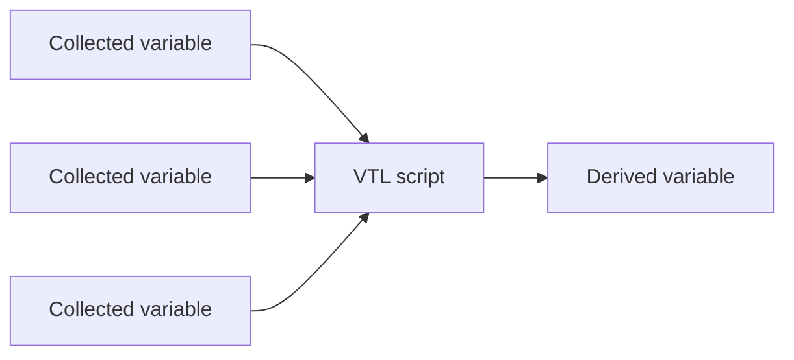
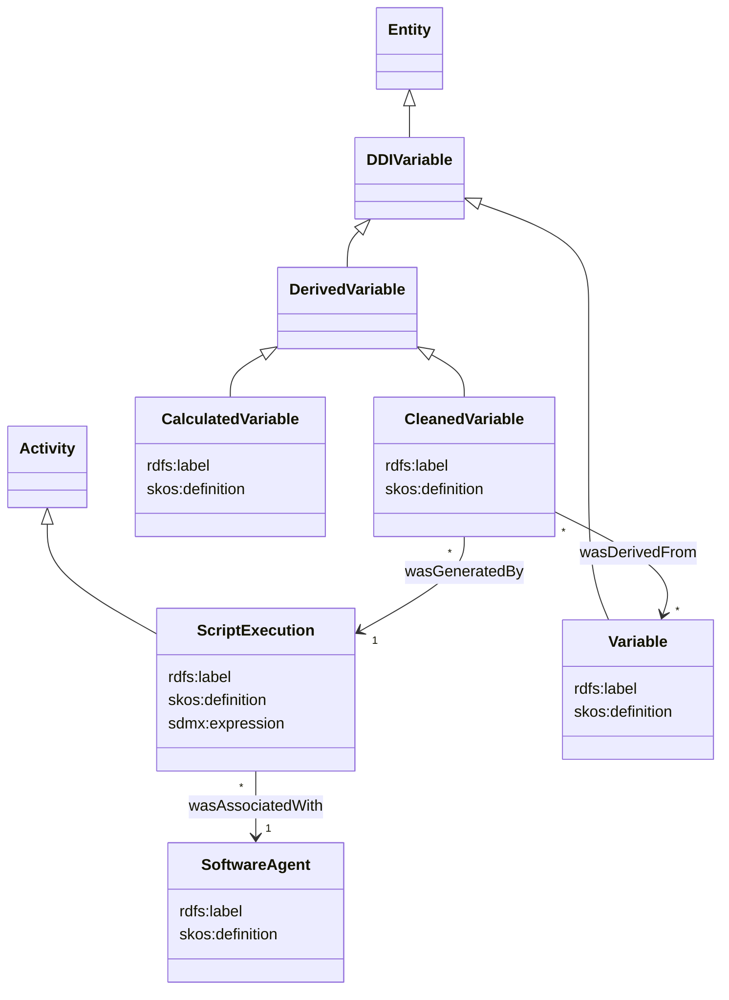

# Provenance

## Description

TODO

## Variables

### Business use case TODO

A derived variable is obtained via a VTL script involving one or more collected variables.



### Modelisation

Based on `RDFS`, `PROV-O` and `SKOS` ontologies.



### Example

```vtl
ds_sum := ds1 + ds2;
ds_mul := ds_sum * 3; 
ds_res <- ds_mul[filter mod(var1, 2) = 0]
```

```ttl
@PREFIX org: <http://example.com/>
@PREFIX prov: <http://www.w3.org/ns/prov#>
@PREFIX sdth: <http://rdf-vocabulary.ddialliance.org/sdth>

<org/program1>  a sdth:Program ;
                a prov:Agent ; // is it an agent?
                rdfs:label "My program 1"@en, "Mon programme 1"@fr ;
                sdth:hasProgramStep <org/program1/program-step1>, <org/program1/program-step2>, <org/program1/program-step3> ;

<org/program1/program-step1>    a sdth:ProgramStep ;
                                sdth:hasSourceCode "ds_sum := ds1 + ds2;" ;
                                sdth:consumesDataframe <org/dataset/ds1>, <org/dataset/ds2> ;
                                sdth:producesDataframe <org/dataset/ds_sum> .

sdth:DataframeInstance


<constances/vtl/ds1> a sdth:DataframeInstance ;
	a prov:entity
	sdth:hasVarInstance <constances/vtl/var1>
```