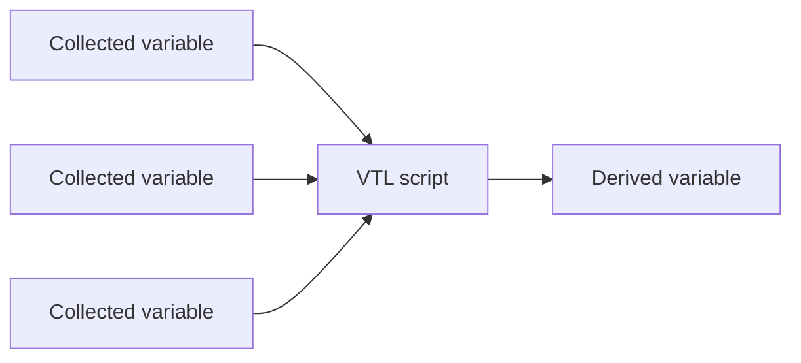
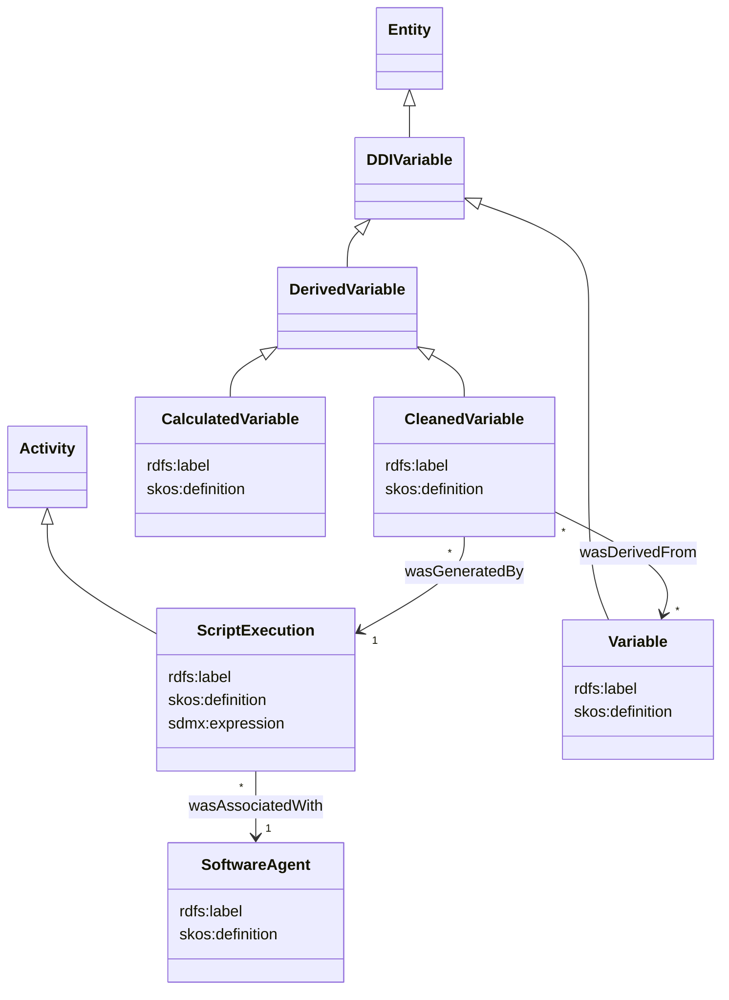

# Provenance

## Description

TODO

## Variables

### Business use case TODO

A derived variable is obtained via a VTL script involving one or more collected variables.



### Modelisation

Based on `RDFS`, `PROV-O` and `SKOS` ontologies.



### Example

#### Inputs

`ds1` & `ds2` metadata

|id|var1|var2|
|:-:|:-:|:-:|
|STRING|INTEGER|NUMBER|
|IDENTIFIER|MEASURE|MEASURE|

#### VTL script

```vtl
ds_sum := ds1 + ds2;
ds_mul := ds_sum * 3; 
ds_res <- ds_mul[filter mod(var1, 2) = 0][calc var_sum := var1 + var2];
```

#### Model target

```ttl
@PREFIX org: <http://example.com/>
@PREFIX prov: <http://www.w3.org/ns/prov#>
@PREFIX sdth: <http://rdf-vocabulary.ddialliance.org/sdth>

# --- Program and steps
<org/program1>  a sdth:Program ;
                a prov:Agent ; # Agent? Or an activity
                rdfs:label "My program 1"@en, "Mon programme 1"@fr ;
                sdth:hasProgramStep <org/program1/program-step1>, <org/program1/program-step2>, <org/program1/program-step3> ;

<org/program1/program-step1>    a sdth:ProgramStep ;
                                sdth:hasSourceCode "ds_sum := ds1 + ds2;" ;
                                sdth:consumesDataframe <org/dataset/ds1>, <org/dataset/ds2> ;
                                sdth:producesDataframe <org/dataset/ds_sum> ;
								sdth:usesVariable <org/dataset/var1>, <org/dataset/var2> . # Do we need / have to declare it?

<org/program1/program-step2>    a sdth:ProgramStep ;
                                sdth:hasSourceCode "ds_mul := ds_sum * 3;" ;
                                sdth:consumesDataframe <org/dataset/ds_sum> ;
                                sdth:producesDataframe <org/dataset/ds_mul> ;
								sdth:usesVariable <org/dataset/var1>, <org/dataset/var2> . # Do we need / have to declare it?

<org/program1/program-step3>    a sdth:ProgramStep ;
                                sdth:hasSourceCode "ds_res <- ds_mul[filter mod(var1, 2) = 0][calc var_sum := var1 + var2];" ;
                                sdth:consumesDataframe <org/dataset/ds_mul> ;
                                sdth:producesDataframe <org/dataset/ds_res> ;
								sdth:usesVariable <org/dataset/var1>, <org/dataset/var2> . # there i think it's ok

# --- Variables 
# i think here it's not instances but names we refer to...
<org/dataset/id1> a sdth:VariableInstance .
<org/dataset/var1> a sdth:VariableInstance .
<org/dataset/var2> a sdth:VariableInstance .
<org/dataset/var_sum> a sdth:VariableInstance .

# --- Data frames
<org/dataset/ds1> a sdth:DataframeInstance ;
                  sdth:hasName "ds1" ;
                  sdth:hasVariableInstance <org/vtl/id1> ;
                  sdth:hasVariableInstance <org/vtl/var1> .
                  
<org/dataset/ds2> a sdth:DataframeInstance ;
                  sdth:hasName "ds2" ;
                  sdth:hasVariableInstance <org/vtl/id1> ;
                  sdth:hasVariableInstance <org/vtl/var2> .
                  
<org/dataset/ds_sum> a sdth:DataframeInstance ;
                     sdth:hasName "ds_sum" ;
                     sdth:wasDerivedFrom <org/dataset/ds1>, <org/dataset/ds2> .
					 sdth:hasVariableInstance <org/vtl/id1> ;
					 sdth:hasVariableInstance <org/vtl/var1> ;
                     sdth:hasVariableInstance <org/vtl/var2> .

<org/dataset/ds_mul> a sdth:DataframeInstance ;
			         sdth:hasName "ds_mul" ;
                     sdth:wasDerivedFrom <org/dataset/ds_sum> . 
					 sdth:hasVariableInstance <org/vtl/id1> ;
					 sdth:hasVariableInstance <org/vtl/var1> ;
                     sdth:hasVariableInstance <org/vtl/var2> .

<org/dataset/ds_res> a sdth:DataframeInstance ;
			         sdth:hasName "ds_res" ;
                     sdth:wasDerivedFrom <org/dataset/ds_mul> ;
					 sdth:hasVariableInstance <org/vtl/id1> ;
					 sdth:hasVariableInstance <org/vtl/var1> ;
                     sdth:hasVariableInstance <org/vtl/var2> ;
					 sdth:hasVariableInstance <org/dataset/var_sum> .


```