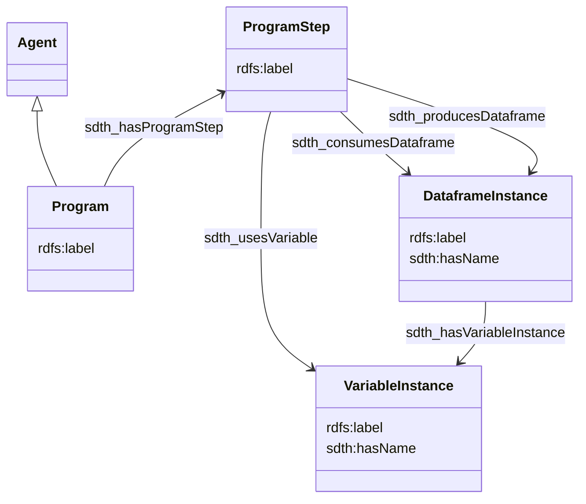

# Provenance

## Description

[Data provenance](https://www.nnlm.gov/guides/data-glossary/data-provenance) is key to a good data management. 

his document present how we could extract some provenance from a VTL program in Trevas, using linked open data standards:

- [PROV](https://www.w3.org/TR/prov-o/)
- SDTH (ref ?)

## Modelisation

Based on `PROV-O` and `SDTH` ontologies.



## Example

### Business use case

Two sources datasets are transformed to produce transient datasets and a final permanent one.


### Inputs

`ds1` & `ds2` metadata

|id|var1|var2|
|:-:|:-:|:-:|
|STRING|INTEGER|NUMBER|
|IDENTIFIER|MEASURE|MEASURE|

### VTL script

```vtl
ds_sum := ds1 + ds2;
ds_mul := ds_sum * 3; 
ds_res <- ds_mul[filter mod(var1, 2) = 0][calc var_sum := var1 + var2];
```

### RDF model target

```ttl
PREFIX rdfs: <http://www.w3.org/2000/01/rdf-schema#>
PREFIX prov: <http://www.w3.org/ns/prov#>
PREFIX sdth: <http://rdf-vocabulary.ddialliance.org/sdth#>

# --- Program and steps
<http://example.com/program1> a sdth:Program ;
    a prov:Agent ; # Agent? Or an activity
    rdfs:label "My program 1"@en, "Mon programme 1"@fr ;
    sdth:hasProgramStep <http://example.com/program1/program-step1>,
                        <http://example.com/program1/program-step2>,
                        <http://example.com/program1/program-step3> .

<http://example.com/program1/program-step1> a sdth:ProgramStep ;
    rdfs:label "Program step 1"@en, "Étape 1"@fr ;
    sdth:hasSourceCode "ds_sum := ds1 + ds2;" ;
    sdth:consumesDataframe  <http://example.com/dataset/ds1>,
                            <http://example.com/dataset/ds2> ;
    sdth:producesDataframe <http://example.com/dataset/ds_sum> ;
    sdth:usesVariable   <http://example.com/dataset/var1>,
                        <http://example.com/dataset/var2> . # Do we need / have to declare it?

<http://example.com/program1/program-step2> a sdth:ProgramStep ;
    rdfs:label "Program step 2"@en, "Étape 2"@fr ;
    sdth:hasSourceCode "ds_mul := ds_sum * 3;" ;
    sdth:consumesDataframe <http://example.com/dataset/ds_sum> ;
    sdth:producesDataframe <http://example.com/dataset/ds_mul> ;
    sdth:usesVariable   <http://example.com/dataset/var1>,
                        <http://example.com/dataset/var2> . # Do we need / have to declare it?

<http://example.com/program1/program-step3> a sdth:ProgramStep ;
    rdfs:label "Program step 3"@en, "Étape 3"@fr ;
    sdth:hasSourceCode "ds_res <- ds_mul[filter mod(var1, 2) = 0][calc var_sum := var1 + var2];" ;
    sdth:consumesDataframe <http://example.com/dataset/ds_mul> ;
    sdth:producesDataframe <http://example.com/dataset/ds_res> ;
    sdth:usesVariable   <http://example.com/dataset/var1>,
                        <http://example.com/dataset/var2> . # there i think it's ok

# --- Variables
# i think here it's not instances but names we refer to...
<http://example.com/variable/id1> a sdth:VariableInstance ;
                                  rdfs:label "id1" .
<http://example.com/variable/var1> a sdth:VariableInstance ;
                                  rdfs:label "var1" .
<http://example.com/variable/var2> a sdth:VariableInstance ;
                                  rdfs:label "var2" .
<http://example.com/variable/var_sum> a sdth:VariableInstance ;
                                  rdfs:label "var_sum" .

# --- Data frames
<http://example.com/dataset/ds1> a sdth:DataframeInstance ;
    rdfs:label "ds1" ;
    sdth:hasName "ds1" ;
    sdth:hasVariableInstance    <http://example.com/variable/id1>,
                                <http://example.com/variable/var1>,
                                <http://example.com/variable/var2> .

<http://example.com/dataset/ds2> a sdth:DataframeInstance ;
    rdfs:label "ds2" ;
    sdth:hasName "ds2" ;
    sdth:hasVariableInstance    <http://example.com/variable/id1>,
                                <http://example.com/variable/var1>,
                                <http://example.com/variable/var2> .

<http://example.com/dataset/ds_sum> a sdth:DataframeInstance ;
    rdfs:label "ds_sum" ;
    sdth:hasName "ds_sum" ;
    sdth:wasDerivedFrom <http://example.com/dataset/ds1>,
                        <http://example.com/dataset/ds2> ;
    sdth:hasVariableInstance    <http://example.com/variable/id1>,
                                <http://example.com/variable/var1>,
                                <http://example.com/variable/var2> .

<http://example.com/dataset/ds_mul> a sdth:DataframeInstance ;
    rdfs:label "ds_mul" ;
    sdth:hasName "ds_mul" ;
    sdth:wasDerivedFrom <http://example.com/dataset/ds_sum> ;
    sdth:hasVariableInstance    <http://example.com/variable/id1>,
                                <http://example.com/variable/var1>,
                                <http://example.com/variable/var2> .

<http://example.com/dataset/ds_res> a sdth:DataframeInstance ;
    rdfs:label "ds_res" ;
    sdth:wasDerivedFrom <http://example.com/dataset/ds_mul> ;
    sdth:hasVariableInstance    <http://example.com/variable/id1>,
                                <http://example.com/variable/var1>,
                                <http://example.com/variable/var2>,
                                <http://example.com/variable/var_sum> .
```