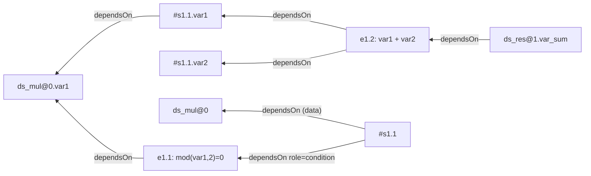
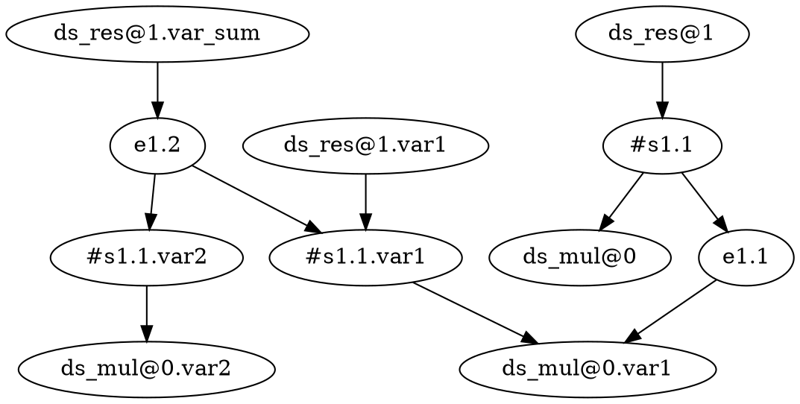

# VTL provenance — graph IR & golden test corpus

> Companion to [`20260728_01_provenance.md`](./20260728_01_provenance.md).
> Defines the in-memory **graph IR** (the contract) and the corpus of
> `.vtl` → `expected.dot` golden cases, one per VTL operation.

## 1. The graph IR

A **schemaless directed property graph**, backed by **JGraphT** (`jgrapht-core`,
already a `vtl-prov` dependency). Conceptually **the graph mirrors the program's
resolved expression tree, with names resolved across statements**. It finishes
the direction the existing `VariableGraphListener` already started (a plain
`DefaultDirectedGraph`). KISS: one relation, capture, convert later.

### 1.1 The whole model

Two generic types, no subclasses:

```
Node = { id: String, props: Map<String, Object> }
Edge = { from: Node, to: Node, props: Map<String, Object> }   // directed
```

- A **Node** is any provenance entity — a *dataset instance* (`ds_mul@0`), a
  *variable instance* (`ds_res@1.var_sum`), **or an expression** (a predicate, a
  `calc` RHS, any sub-expression we name). What it *is* is a property:
  `kind = dataset|variable|expression`, plus `name`, `role`, `type`, `dataset`
  (owning dataset id), `src` (source fragment) — added when known.
- An **Edge** expresses **one relation: `dependsOn`** ("the source is computed or
  selected from the target"), pointing **dependent → dependency** (sink →
  source). Optional annotations: `op` (`filter`, `calc`, `join`…) and `role`
  (`condition` for predicates/selectors; default = value/operand flow).

That is the entire schema. Node kinds, operator identity, roles, types — none are
Java types; all are data. JGraphT holds it as `DirectedPseudograph<Node, Edge>`
(parallel edges allowed; self-loops guarded as `VariableGraphListener` already
does).

### 1.2 One rule, uniform across dataset *and* scalar

**An entity `dependsOn` the entities it is computed or selected from.** The same
rule covers every case — there is no producer/scalar dichotomy, no dropped
selectors:

- a dataset op: `#s1a dependsOn ds_mul@0` (data) **and** `dependsOn e_pred`
  (`role=condition`) — the filter predicate is a node like any other;
- a column: `ds_res.var_sum dependsOn e_calc` where `e_calc` is the expression
  `var1 + var2`;
- a scalar expression: `e_pred (mod(var1,2)=0) dependsOn ds_mul@0.var1`.

Expressions are named at **reference-level**: one node per whole expression
(carrying its `src`), with `dependsOn` edges to the variable/dataset instances it
references. We do **not** explode operators/literals into their own nodes (that
"full AST" depth is the same model taken deeper; out of scope for now).

The only per-operator specificity left is **column-level expansion** for dataset
operators — which output column depends on which input columns (§5). That small
residue is all the per-operation table still carries.

### 1.3 Everything richer is a conversion

Views are pure functions over the raw graph, produced separately — never a second
source of truth:

- **Pure value lineage:** drop `role=condition` edges.
- **Dataset-level lineage:** roll variable/expression `dependsOn` up by `dataset`.
- **Operator/statement view:** group edges by `op` / statement.
- **SDTH/RDF:** value `dependsOn` → `prov:wasDerivedFrom`; condition `dependsOn`
  → `prov:used`. Both predicates already exist. Tested separately.

### 1.4 The ultimate-goal query

"Given a dataset/variable/expression, everything that built it" = follow
`dependsOn` transitively from that node (JGraphT `BreadthFirstIterator` /
`AllDirectedPaths`). The payoff of holding a real graph.

## 2. Worked example — the two-transformation case

Input structure: `ds_mul{ id: STRING/ID, var1: INTEGER/MEASURE, var2: INTEGER/MEASURE }`.

```vtl
ds_res <- ds_mul[filter mod(var1, 2) = 0][calc var_sum := var1 + var2];
```

Data nodes (dataset/variable instances), **expression nodes** (`e1.1` the
predicate, `e1.2` the calc RHS), and `dependsOn` edges. The filter predicate is a
first-class node; the anonymous intermediate `#s1.1` keeps the two clauses
distinct:



The same graph as the golden **DOT** (`expected.dot`) — nodes carry attributes,
edges carry `op`/`role` annotations (every edge is a `dependsOn`). Ordering is
irrelevant (imported and compared as sets); `//` comments are ignored:



The filter is fully represented: `"#s1.1" -> "e1.1" [role=condition]`, and
`"e1.1" -> "ds_mul@0.var1"`. Nothing is dropped and nothing is conflated — the
condition points at a *boolean expression node*, structurally distinct from the
value chain `var_sum → e1.2 → #s1.1.var1 → ds_mul.var1`. Dataset-level lineage
(`ds_res@1 -> ds_mul@0`) and pure value lineage (drop the `condition` edge) are
*views* (§1.3), not stored here.

## 3. Corpus layout

```
vtl-prov/tests/
  01-assignment/     input.vtl  expected.dot
  02-arithmetic/     ...
  ...
```

- `input.vtl` — the script, with input structures declared inline via `$input`
  directives (and optional `$output`), so the case is self-contained. Directive
  format: [`20260729_01_vtl-fixture-directives.md`](./20260729_01_vtl-fixture-directives.md)
  (quick reference in `../tests/README.md`); the keyword set is open/extensible.
- `expected.dot` — the provenance graph as Graphviz **DOT** (the assertion, and
  it renders to a picture for review). Format in §4.

One parameterized test per folder: run provenance → get the JGraphT graph;
**import `expected.dot` via jgrapht-io** into another graph; assert the two are
equal as sets (vertices with attributes, edges with endpoints + attributes).
Because ids are deterministic (§4) no isomorphism search is needed.

## 4. Golden format: DOT (hard requirement: determinism)

Goldens are **Graphviz DOT**, read and written with **`jgrapht-io`**
(`DOTImporter` / `DOTExporter`; add `org.jgrapht:jgrapht-io`, whose parser dep
`antlr4-runtime` VTL already resembles). DOT is chosen because it carries node
*and* edge attributes natively, accepts our ids verbatim as quoted strings, is
hand-writable, and renders to an image directly.

**Ids** — deterministic, no UUIDs (readable forms; exact strings negotiable):

```
dataset      "{name}@{definingStmtIndex}"     bindings @0; anon: "#s{stmt}.{seq}"
variable     "{datasetId}.{componentName}"    e.g. "ds_res@1.var_sum"
expression   "e{stmtIndex}.{seq}"             seq = position in a deterministic AST walk
```

**Conventions:**

- `digraph { … }`; one directed edge per dependency.
- **Node:** `"id" [kind=<k>, …attrs…];` with `kind` ∈ `dataset | variable |
  expression`.
  - variable: `dataset` (owning id), `role`, `type`.
  - dataset: `src` (defining fragment); `anon=true` for intermediates.
  - expression: `src`.
- **Edge:** `"from" -> "to" [op=<clause>, role=condition];`. **Every edge is a
  `dependsOn`** (dependent → dependency) — no `rel` attribute needed. `op` names
  the clause/operator; `role=condition` marks predicates/selectors (absent =
  value/operand flow). Unannotated edges are just `"a" -> "b";`.
- **Membership** is the variable's `dataset` attribute (not a subgraph cluster;
  clusters may be added purely for rendering, they carry no assertion).
- **Quoting:** ids are always quoted. Attribute values are quoted when they
  contain non-identifier characters (ids, `src` text, `op="+"`); plain enums
  (`MEASURE`, `STRING`, `condition`) and `true` may be bare. `src` is a
  single-line string.

**Determinism / comparison.** Ordering is irrelevant: the test imports both sides
via `DOTImporter` and compares the vertex set (id + attribute map) and edge set
(ordered endpoints + attribute map). Deterministic ids make this a plain set
equality; a mismatch reports added/removed vertices or edges. `//` and `/* */`
comments are allowed and ignored, so fixtures may keep section headers for
readability.

## 5. Per-operation rules

Notation: `out.v ← in.a` means `out.v dependsOn in.a` (annotated `op=<clause>`).
Each row is one corpus folder.

### 5.0 General principle — value vs. condition dependencies

Every operand an operator touches becomes a `dependsOn` edge; the `role`
annotation records *how* it contributes:

- **Value** (default, no `role`) — its values flow into the output → the output
  entity `dependsOn` it.
- **Condition** (`role=condition`) — it decides *which rows* survive or how they
  group. It is captured as a `dependsOn` edge on the **predicate expression node**
  (§1.2), not dropped and not conflated with value flow.

`setdiff`'s second operand, `filter`/`where` predicates, `sub` conditions, and
analytic `partition by`/`order by` keys are all conditions; the operands whose
columns appear in the result are value inputs. Any operator not enumerated below
defaults to this principle.

| # | Op | Rule (variable lineage + notable nodes) |
|---|---|---|
| 01 | assignment `:=` / persistent `<-` | identity: `out.v ← in.v` ∀v. `<-` sets PERSIST flag (later: `FileInstance`). |
| 02 | arithmetic `ds1+ds2`, `ds*3` | ids must match: `out.id ← ds1.id, ds2.id`. each shared measure `m`: `out.m ← ds1.m, ds2.m`. scalar operand not a node (kept in source fragment). |
| 03 | `calc v := a+b` | `out.v ← in.a, in.b` (all RHS vars); untouched `w`: `out.w ← in.w`. |
| 04 | `filter`/`where` | all pass through `out.w ← in.w`; predicate is an expression node, `out dependsOn predicate role=condition` (§5.0, §5.4). |
| 05 | `keep`/`drop`/`ds#comp` (projection) | VTL has no `project` keyword — projection *is* keep/drop (kept pass through, dropped absent). Component membership `ds#comp` projects one component into a dataset: `out.comp ← ds.comp`. |
| 06 | `rename sex to sex_old` | `out.sex_old ← in.sex`; others pass through. |
| 07 | `aggr m := sum(x) group by id` | `out.id ← in.id`; `out.m ← in.x`; group-by keys are value inputs (they define the surviving identifiers); non-grouped/non-aggregated measures dropped. |
| 08 | `join` (`inner_join`, `left_join`, `using`) | keys: `out.id ← ds1.id, ds2.id`; each carried measure from its origin operand; collisions per VTL rename rules. |
| 09 | `union` | same structure required; rows concatenated + dedup on identifiers. Every component: `out.v ← ds1.v, ds2.v, …` (all operands are value inputs). Dataset: `out ← each operand`. |
| 10 | `intersect` / `symdiff` | same structure; both operands contribute the surviving rows' values → `out.v ← ds1.v, ds2.v` ∀v (both value inputs). |
| 11 | `setdiff` (`ds1 - ds2` set sense) | result rows/values come only from `ds1`: `out.v ← ds1.v` ∀v. `ds2` is a **condition** (decides exclusion) → `out dependsOn ds2 role=condition`. |
| 12 | analytic `over(partition by p order by o)` | `out.m ← in.m` (windowed measure, `op=over`); `p`/`o` are conditions → `role=condition`. |
| 13 | dataset-level scalar/unary fn (`abs(ds)`, `ds1 and ds2`, comparisons) | like calc over all measures: `out.m ← in.m` (and other operand's `m`); scalar literals not nodes. |
| 14 | `sub` clause (`ds[sub id = "x"]`) | filters on an identifier value **and** drops it: surviving components pass through; the sub condition is an expression node (`role=condition`); the sub'd identifier absent from output. |
| 15 | `pivot`/`unpivot` | data-dependent output columns; `out.<value> ← pivoted measure + identifier`. Tiny fixed inputs + canonical sort. Lands last. |
| 16 | `check_*` + `define … ruleset` | validation columns (`bool_var`/`errorcode`/`errorlevel`) derive from validated vars; ruleset recorded as an edge annotation (`ruleset=<name>`) or a node, TBD. |
| 17 | UDF `define operator` + call | black-box: output vars derive from the declared input vars (annotate `op=<operatorName>`). Inlining the body's internal lineage is a later enhancement (flag it). |

### 5.4 Filter/where — resolved by expression nodes

A predicate influences which **rows** survive, i.e. it affects the dataset as a
whole, not any specific output column. We neither drop it nor smear it across
every column: the predicate is its own **expression node** (`e_pred`, carrying
its `src`), the filtered dataset does `#s1a dependsOn e_pred role=condition`, and
`e_pred dependsOn` the variables it references. Value lineage stays clean (drop
`role=condition` for that view); the predicate is fully recoverable.

## 6. VTL operator catalogue (completeness index)

Every VTL-ML/DL operator, so nothing is silently omitted. These classes describe
how the **extraction** treats an operator — they are *not* IR node types (the IR
has none; see §1). They resolve to `dependsOn` edges annotated with the operation:

- **producer** — yields a dataset → emits `dependsOn` edges between its output
  and input instances, annotated `op=<operator>`; detailed rule in §5 (row noted)
  or defaults to §5.0.
- **scalar** — a component/scalar operator appearing *inside* an expression
  (`calc` RHS, a `filter`/`sub` predicate, an `aggr`/analytic arg). At
  reference-level it does not get its own node; it is subsumed by the enclosing
  **expression node**, which `dependsOn` the variables it references. Applied at
  the *dataset* level (VTL overloads most of them, e.g. `abs(ds)`, `ds1 || ds2`,
  `ds1 and ds2`) it is a producer, component-wise as §5 row 13.
- **definition** — a DL statement; recorded as an edge annotation (or a small
  definition node) referenced by the producers that use it, not a dataframe.
- **structural** — nothing emitted (parentheses, ordering).

> Granularity dial: expressions are represented at **reference-level** — one node
> per whole predicate/RHS, with `dependsOn` edges to the instances it references
> (§1.2). "Full AST" (a node per operator/literal) is the same model taken
> deeper; out of scope for now. Operator identity lives on edge annotations.

### 6.1 General & assignment
| Operator | Treatment |
|---|---|
| `:=` temporary assign, `<-` persistent assign | producer (§5.01) |
| `#` membership | producer (§5.05) |
| user-defined operator call | producer (§5.17) |
| `eval` (external routine) | producer, black-box like UDF — flag |
| `cast` | scalar (type conversion) |
| `( )` parentheses | structural |

### 6.2 Join / set / clause (producers)
| Operator | Treatment |
|---|---|
| `inner_join`, `left_join`, `full_join`, `cross_join` | producer (§5.08) |
| `union`, `intersect`, `setdiff`, `symdiff` | producer (§5.09–11) |
| clauses: `filter`, `calc`, `aggr`, `keep`, `drop`, `rename`, `pivot`, `unpivot`, `sub`, `apply` | producer (§5.03–07,14,15; `apply` ≈ calc over components) |

### 6.3 Aggregation & analytic
| Operator | Treatment |
|---|---|
| `count`, `sum`, `avg`, `min`, `max`, `median`, `stddev_pop`, `stddev_samp`, `var_pop`, `var_samp` | scalar-aggregate → aggregated measure `dependsOn` arg components (§5.07) |
| `group by` / `group all` | value-input keys (§5.07); `having` → selector (§5.0) |
| `first_value`, `last_value`, `lag`, `lead`, `rank`, `ratio_to_report` (+ aggregates `over`) | producer-context (§5.12); `partition by`/`order by` → selectors |

### 6.4 Validation & definition
| Operator | Treatment |
|---|---|
| `check`, `check_datapoint`, `check_hierarchy` | producer (§5.16) |
| `hierarchy` (aggregation) | producer — hierarchical roll-up; `out.m ← in.m` per rule, ruleset as edge annotation. Not yet in §5 — **add** |
| `define datapoint ruleset`, `define hierarchical ruleset` | definition |
| `define operator` | definition (used by §5.17) |
| `define structure` / `define datastructure` | definition |

### 6.5 Conditional
| Operator | Treatment |
|---|---|
| `if-then-else`, `nvl`, `case` (2.1) | scalar inside `calc`; at dataset level → component-wise producer (§5.13) |

### 6.6 Scalar operators (all treatment = scalar; dataset-level → §5.13)
| Category | Operators |
|---|---|
| Numeric | unary `+`/`-`, `+`, `-`, `*`, `/`, `mod`, `round`, `trunc`, `ceil`, `floor`, `abs`, `exp`, `ln`, `log`, `power`, `sqrt` |
| Comparison | `=`, `<>`, `<`, `<=`, `>`, `>=`, `between`, `in`, `not_in`, `match_characters`, `isnull`; `exists_in` (dataset-level → **producer**, flag) |
| Boolean | `and`, `or`, `xor`, `not` |
| String | `\|\|`, `trim`, `ltrim`, `rtrim`, `upper`, `lower`, `substr`, `replace`, `instr`, `length` |
| Date/time scalar | `period_indicator`, `current_date`, `dateadd`, `datediff`, `getyear`, `getmonth`, `daytoyear`, `daytomonth`, `yeartoday`, `monthtoday` |

### 6.7 Time-series (producers)
| Operator | Treatment |
|---|---|
| `fill_time_series`, `flow_to_stock`, `stock_to_flow`, `timeshift`, `time_agg` | producer — measures pass through (`out.m ← in.m`), time identifier reshaped. Not yet in §5 — **add** if in scope |

## 7. Build order

1. ~~Lock the IR (§1) + the worked example (§2).~~ **Done.**
2. ~~Hand-author the corpus (`input.vtl` + `expected.dot` per §5).~~ **Done**
   (cases 01–17 + chain-filter-calc, Graphviz-validated).
3. Implement in review-sized steps — see the PR ladder in
   [`20260729_02_work-breakdown.md`](./20260729_02_work-breakdown.md). In short:
   **harness first** (corpus reader, `$input` parsing, `jgrapht-io` DOT import,
   set-equality comparator, `ProvenanceExtractor`, golden self-check; all provenance
   cases failing until implemented), then one extraction capability per PR, each
   turning specific corpus cases green. Walk = **`VtlBaseVisitor<Void>`** mutating
   `ProvGraph` (see work-breakdown Mechanisms);
   SDTH/RDF conversion and deletion of the old listeners close it out.
   For **same triples as today**: project IR → existing `Program` → reuse `RDFUtils`
   (see [`20260808_01_rdf-compatibility-view.md`](./20260808_01_rdf-compatibility-view.md)).
   Richer RDF is a later, separate view.
